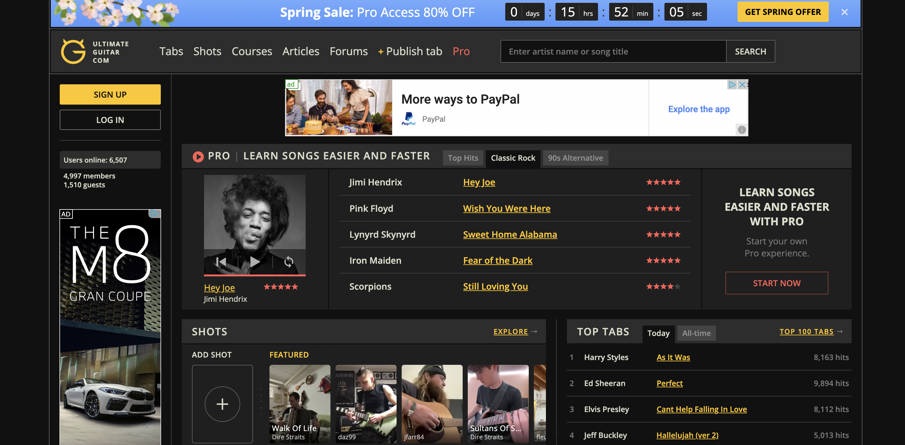

# Improving User Experience on UltimateGuitar.com Tabs

James Yoon

Digital Humanities 110: *User Experience and Design* (Spring '22)

### Introduction

When first learning guitar, many learners gravitate toward learning the chord progressions for their favorite songs, whether they be from rock, country, pop, or other genres. By practicing the finger placement associated with each chord and basic strumming, amateur guitar players can start to play a wide range of songs, which can boost their confidence and motivate them to keep practicing. 

Amateur and experienced guitar players have different needs when it comes to chord progressions. New players may need more detailed instructions and the ability to transpose chords with a capo so that complicated chords (like the six-string F chord or the B chord) can be played like simpler, beginner-friendly chords (like C or E). On the other hand, experienced guitar players may want the original song's chords to practice barre chords or more advanced strumming techniques.

This project will look at [UltimateGuitar.com](https://www.ultimate-guitar.com/) to improve its user experience for guitar players of all skill levels. UltimateGuitar.com provides tabs (chords) for 1,100,000 songs, and many tabs are crowd-sourced and rated for accuracy by fellow players.

For this heuristics assignment, I will compare UltimateGuitar.com's UX with [Chordify](https://chordify.net/en), a similar service that creates guitar tabs from YouTube videos. Both services have free and paid versions — this heuristic analysis will only analyze the free versions.

### 10 Usability Heuristics

To evaluate the user experience of each site, I will use [Nielsen's 10 Usability Heuristics](https://www.nngroup.com/articles/ten-usability-heuristics/).

| Heuristic      | Description |
| ----------- | ----------- |
| 1. Visibility of system status      | Websites and apps should tell users the "status" of the system. This can include whether a page is loading, whether there is an error, or whether the device is connected to the Internet. There needs to be a way that they can monitor this **easily** without having to sift through the website.       |
| 2. Match between system and real world    |  To make a design intuitive, logos and symbols used in the website/app need to correspond with what users already see in the real world. One should minimize as much interface-specific jargon as possible so that users can infer which controls or designs lead to what actions or subpages.    |
| 3. User control and freedom    | Interfaces need to have a way for users to exit (i.e. back to the homepage). Users don't want to be pigeonholed into a specific process; they need the flexibility to stop what they're doing and do something else without having to force quit the app.       |
| 4. Consistency and standards    | Not only should there be a match between your interface and the *real world* (#2), but you should also keep other apps and standardized designs in mind as well. Like #2, one should use a limited amount of jargon and make the interface similar in function to similar apps that users may have used in the past.       |
| 5. Error prevention    | *We all make mistakes!* As a UX designer, it's important to expect these errors and to prevent them from occurring using safe-guards (e.g. "Invalid output!") or confirmation messages.       |
| 6. Recognition rather than recall   | We can only store a limited amount of information in our brains at once. Rather than forcing users to remember certain functions from a long tutorial, it's important to make the design as intuitive as possible so that they don't have to navigate convoluted pathways to get to where they need to be or remember what a specific button does.       |
| 7. Flexibility and efficiency of use    | There should be some level of customization! Expert and beginner users will likely have different needs, so by tailoring too much to one population, you may miss out on the other. One should make their interface beginner-friendly while providing shortcuts for more experienced users.        |
| 8. Aesthetic and minimalist design    | Design should be focused on what's important. Superfluous content may detract from what's important! Clutter or decoration may unnecessarily increase a user's cognitive load.        |
| 9. Help users recognize, diagnose, and recover from errors    | Users should know when they have encountered an error and what steps to take afterward. A 404 error may mean a lot to an IT specialist, but a novice user may not understand what it means. One should put the error message into plain terms and guide them through troubleshooting.        |
| 10. Help and documentation    | Similar to #9, if errors occur, there should be resources to help users troubleshoot. This documentation should be accessible and easy to search, and it should be readable by users not familiar with IT.        |

I'll rank each site by each of the ten usability heuristics, in addiiton to a severity score relating to how urgently this heuristic should be fixed. The severity score is in the range \[1,3\], with 1 being not severe and 3 being the most severe.

### UltimateGuitar.com

[UltimateGuitar.com](https://www.ultimate-guitar.com/) hosts 1,100,000 guitar tabs, as well as forums, guided guitar courses, and video hosting for users to share their own guitar recordings. Although most of the tabs are crowd-sourced, each tab is associated with a rating out of five stars that players can use to rate how well the tab corresponds to the original song's progression. 

From my first impressions prior to heuristic evaluation, UltimateGuitar strives to be a one-stop center for all guitar enthusiasts: by hosting tabs, courses, and a forum, guitar players can build community while learning their favorite songs. In addition, its crowd-sourcing creates a large library of tabs, and the rating system allows more accurate chords to be indicated over lower-quality tabs. However, I do wonder if its rather cluttered design may be a result of its wide range of purposes. By focusing on too many things, it's hard to pinpoint exactly what's important.

There is a lot of dynamic content on the frontpage - for instance, the featured tab changes every 5 seconds or so. This might make it difficult for people who have slow Internet connections. Furthermore, viewing the website on smaller screens makes the ratings run into the banner ads on the side, so I suspect the website isn't mobile/small-screen optimized. Finally, the ads are very invasive and degrade the experience quite drastically.

| Heuristic      | Evaluation | Severity Score (3 being the most)|
| ----------- | ----------- | ----------- |
| 1. Visibility of system status      | From the frontpage, we see that there's a large blue banner ad at the top that advertises a spring sale, and there's another ad that encourages you to buy Pro. When searching up tabs for Harry Styles' song "As It Was", a large "Pro" sign and red coloring indicates that only subscription members can access a recording of this tab. Overall, this website does a good job of showing the system/account status: in this case, of what features we have as a free member.    | 1 |
| 2. Match between system and real world    | I navigated to the tabs for "So Hot You're Hurting My Feelings" by Caroline Polachek, and I see that the website displays fingerings at the top in standard guitar notation. A new player may not know how to read these diagrams, so I would recommend having the option for more guided tabs or a link to a tutorial that teaches them how to read it. Nevertheless, these diagrams mirror real-life fingerings well, as it is basically a schematic of the guitar board itself.       | 2 |
| 3. User control and freedom    | If you press "Publish tab" at the top, the website layout completely changes so that you can't go back to the homepage or the main menu without pressing "Back" on your web browser. This makes it difficult to undo if you accidentally press this tab. To solve this, they should keep the main menu bar present in this subpage.        | 2 |
| 4. Consistency and standards    | Similarly to #2, the guitar fingering schematics are similar to other websites and guitar guides. However, the use of the word "Shots" in the main menu to refer to TikTok-like videos is UltimateGuitar-specific jargon and should be replaced with "Videos". Furthermore, the word "hits" should be replaced with "Views", since "hits" can also be considered website-specific jargon.      | 3 |
| 5. Error prevention    | By searching for a string of random letters (e.g. "sldfjslak"), I received a message that "Sorry, there are no songs found for your request (unless you typed it wrong)". The message then provided the option for me to make a new tab. This is a great way to prevent typing errors, as it highlights a potential issue while giving the user flexibility to create their own tab if it wasn't actually a misspelling.        | 1 |
| 6. Recognition rather than recall   | When you navigate to "Shots" (video hosting similar to TikTok), there is a blue dialogue bubble at the bottom that directs you to "TURN ON THE SOUND"; the arrow is clear as to where it points, and the sound icon is a standard speaker icon with a X when muted. Overall, this website fulfills this heuristic well.       | 1 |
| 7. Flexibility and efficiency of use    | Although there is a lot of flexibility in this design that allows beginner, intermediate, and advanced users to navigate the site, it is clearly tailored toward intermediate and advanced users. The portion of the site tailored to beginners ("Courses") is the third menu option and is fairly hidden on the homepage. When searching for a tab, one can pick the difficulty on the left hand side, but this option is immediately followed by "Tuning" (which is a slightly more advanced concept. I would recommend making the design more accessible for beginners while providing shortcuts for more advanced players, rather than the opposite way around. At the very least, the Courses tab should be the second menu option and more advertised on the home page.          | 3 |
| 8. Aesthetic and minimalist design    | I would say that this is the heuristic that is most in need of improvement. The homepage is incredibly cluttered, with multiple unrelated sections (tabs, followed by shots, followed by another tabs section. There's a section on Backing Tracks which is not mentioned elsewhere on the site and even a section that lists Users by UltimateGuitar "IQ". I would recommend revamping the design so that the Tabs and Courses are front and center.        | 3 |
| 9. Help users recognize, diagnose, and recover from errors    | I entered "ultimate-guitar.com/sdfkjsldkgjslkjdg" in my browser, and a fairly readable "Oops, we couldn't find that page." popped up, along with options to return to the homepage or report a problem. I think this website fulfills this heuristic quite well, with the exception that it is white text on a GIF with a white sky, which may impact readability.        | 2 |
| 10. Help and documentation    | By clicking "Report a Problem" on Heuristic 9, you're directed to a customer service page that has a large search bar at the top, followed by "Top Questions". The documentation is fairly well-written, although there are tags like \[website\] before the question that could be moved below the question itself. There's also a stock picture of a man with the caption "This guy knows what to do." for immediate customer support. Overall, aside from maybe changing the placement of the tags, the website fulfills this heuristic well.    | 1 |

## Chordify

[Chordify](https://chordify.net/en) is a service similar to Ultimate-Guitar.com that generates tabs for a wide variety of pop, rock, and country songs. The website uses YouTube videos (or videos on other hosting sites) to automatically create tabs, as opposed to Ultimate-Guitar's crowd-sourcing. 

My first impressions of the site were that the color scheme and the layout was overall much less cluttered and more pleasing than Ultimate-Guitar. The site was clearly mobile-optimized, as I was able to decrease my screen size without any overflow. The design appears a lot more intuitive and more novice-friendly, which may be due to this site's narrower scope (it doesn't have a video hosting subpage or a forum). 

| Heuristic      | Description | Severity Score |
| ----------- | ----------- | ----------- |
| 1. Visibility of system status      | Like Ultimate-Guitar, there is a banner ad at the top that advertises a spring sale on Premium. In addition, the service makes it clear that free members can only access two songs per day. By checking out one tab, you have a large but non-invasive message saying "Enjoy your free song! You have one free song remaining today. Create an account and receive an additional 3 free songs!" below the tab itself. Overall, Chordify does a good job of keeping the system status clear.        | 1 |
| 2. Match between system and real world    | By searching the tabs for "So Hot You're Hurting My Feelings" by Caroline Polachek, we see similar fingering diagrams as Ultimate-Guitar. However, these are both larger and have the finger "number" (1 being pointer, 2 being middle, etc...) directly on the bar/spot itself. This is a better design than Ultimate-Guitar, as it mirrors exactly how the fingers should be laid out on the guitar in real-time.        | 1  |
| 3. User control and freedom    | The menu bar is present across all subpages except the "Pricing" tab. In that subpage, the menu disappears, forcing you to press "Back" on the browser rather than pressing something on the website itself. However, one strength is that if you press "Create Account", there is a small X at the top of the page that allows you to return back to home.         |2 |
| 4. Consistency and standards    | Overall, the consistency with fingering diagrams is great between Chordify and other guitar sites. They also have the option to create playlists, and they use the typical logo for playlists (three vertical lines with a + sign at the bottom right). The website excels at this heuristic.        | 1 |
| 5. Error prevention    | Similar to Ultimate-Guitar, by typing in "sdfkjsdlkfsj" into the searchbar, we're met with a picture of a frog and the text "Ribbit! Nothing here but me! Search for another song." This provides a good and clear visual and a concrete action item. Furthermore, by typing an invalid email address on the "Create an Account" page, we get a "The ermail address you've entered is invalid." message. The website also excels at this heuristic.       |1 |
| 6. Recognition rather than recall   | In addition to the intuitive playlist icon, the tab interface is easy to use (press the Play button and watch the bar move across the screen, which temporarily enlarges the chord diagram. One minor change is that I would change the menu option "Improve" - "Improve" is a fairly vague term, and "Options" might better encapsulate it. Finally, this "Improve" tab is confusing and should be associated with a tutorial option, as there are many options and selection tools but little to explain it minus a tutorial back at the homepage.        |3|
| 7. Flexibility and efficiency of use    | This website excels at being applicable to both beginner and experienced users. There is a button to "Simplify chords" if the chords are too complex, as well as options to transpose, to adjust the capo, or even change the time signature and meter. However, one area for improvement is that it may be too dependent on interactivity. For devices with slow Internet connection, it is difficult to read these tabs as there are no lyrics associated with each chord. It is clearly designed so that you play the chords while playing the audio at the same time, which limits the website's potential audience.        | 3 |
| 8. Aesthetic and minimalist design    | The design is functional and minimalist. Each section has a descriptive header ("Songs with Easy Chords", "Women in Music", "Explainer Video and Help"). In the tabs themselves, the tab is front-and-center, and any suggestions for other songs and other options are on the side or hidden behind menus. Compared to Ultimate-Guitar, this design is excellent and focuses on what's important.       | 1 |
| 9. Help users recognize, diagnose, and recover from errors    | Upon typing chordify.net/sldkjfslkdgjsalk, we observe the same frog from Heuristic 5 with the text "Nothing here but me!" and links to an About page, a Discover page, Channels, and a blog. The message is less clear than Ultimate-Guitar's error page on Heuristic 9, and there is no link to customer service or a Help page which should be in place of the About Chordify or Discover link.        |3 |
| 10. Help and documentation    | As stated for Heuristic 9, there is no help or documentation page on the error page. If you encounter issues, there is a "Help" button at the bottom of the screen that is visible but not too invasive, but opening that up only creates a "Leave us a message" prompt and not FAQs/documentation. There should at least be an option to check out FAQs from this pop-up.        |3 |
