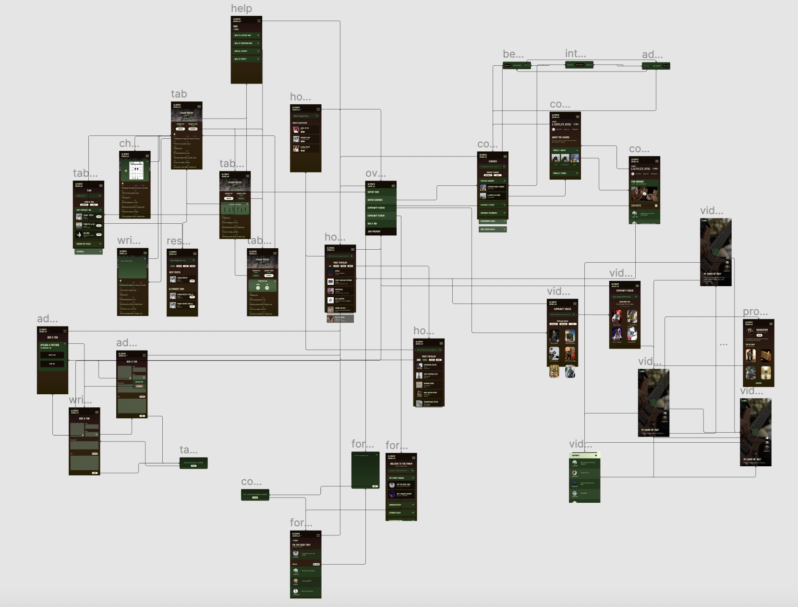

# Assignment 07: High-Fidelity Prototype

James Yoon

Digital Humanities 110 - *User Experience and Design* (S'22)

# What is a High-Fidelity Prototype?

A high-fidelity prototype takes the static layouts and interfaces from the low-fidelity prototype into an interactive prototype that one can interact with. 

My project involved redesigning Ultimate-Guitar.com so that it was more user-friendly and more accessible for both beginner and advanced guitar players, particularly for my target audience of middle-aged male guitar learners. Following the low-fidelity prototype and interface design process, I added interactivity on Figma. I also went through multiple interations of my prototype after conducting 4 usability tests and a cognitive walkthrough.

# Prototype Tasks

Based on my contextual inquiry and personas/usage scenarios, my prototype supports the following tasks:

- Navigating guitar tabs; adding comments; and reading the tab's strumming patterns, key and chord fingerings (specifically, Bjork's Pagan Poetry - although this song is merely a model for the overall interactivity)
- Navigating the courses on Ultimate-Guitar and clicking on videos/adding comments
- Searching through and liking/commenting on community-uploaded videos
- Searching through the Ultimate-Guitar forums and replying to a forum thread
- Adding a tab (not a main task as indicated in the Usability Testing or the personas; added for completeness)

# Wireflow

The complete wireflow of my prototype can be found below. [A version of the wireflow on Figma can be accessed here.](https://www.figma.com/file/seDni8nNltXHUxyWOMq300/Ultimate-Guitar-A07?node-id=201%3A203)

# Final Version (3.0) of the High-Fidelity Prototype

[The high-fidelity prototype for my Ultimate-Guitar redesign can be found here.](https://www.figma.com/proto/seDni8nNltXHUxyWOMq300/Ultimate-Guitar-A07?node-id=333%3A1442&scaling=scale-down&page-id=333%3A1441&starting-point-node-id=333%3A1442)

[The Figma file for the prototype can be found here.](https://www.figma.com/file/seDni8nNltXHUxyWOMq300/Ultimate-Guitar-A07?node-id=333%3A1441)

 

# Testing the Prototype

Prior to creating the final prototype (version 3.0) as shown above), the prototype was tested in the following ways:

## Cognitive Walkthrough

A cognitive walkthrough was conducted with two other classmates during Week 8. The walkthrough took 15 minutes (from approximately 4:30 to 4:45 PM). During the walkthrough, the two classmates gave their overall impressions of the prototype and completed three tasks according to my personas: visiting and commenting on a guitar course, accessing a guitar tab, and navigating through the community videos/forums. [The initial prototype used for the cognitive walkthrough can be found here](https://www.figma.com/proto/seDni8nNltXHUxyWOMq300/Ultimate-Guitar-A07?node-id=201%3A204&scaling=contain&page-id=201%3A203&starting-point-node-id=201%3A204); this was my first iteration after interface design on the homepage. [The complete comments from my classmates can be accessed here](https://docs.google.com/document/d/1h0lXeB5dxPP1mZsDMxuq8wOFXPu83NUWpwksPKupgX8/edit?usp=sharing).

### Summary of Cognitive Walkthrough

> One of the classmates remarked that the prototype looks professional and that it has a lot of information!

> Both had a relatively good idea of what Ultimate-Guitar's purpose was after solely looking at the homepage.

> They remarked that the homepage was incomplete and that the buttons for "Courses", "Videos", and "Forum" were not interactive.

This was something I decided to work on for my final prototype. At the very least, I wanted to include interactivity for the Courses button to show how these layouts would work!

> One classmate noted that there was no way to follow or like the videos to save them for later. 

I decided to add a way to like the video and follow the uploaders on my final prototype! I also made sure to add interactivity so that when someone liked a video, the icon turned full white (rather than outlined in white).

> One said it would be nice to have checkmarks after someone finishes a video in the course.

I thought it was a great idea! I was hesitant to add this interactivity on the prototype as there was no way to actually play videos (and thus finish a video) on Figma.

 

# Usability Testing

After the cognitive walkthrough and before usability testing, I created version 1.0 of my prototype, [which can be accessed here](https://www.figma.com/proto/2bDBQXIf77SMKvtWaLMbE2/Ultimate-Guitar-A07-(Archived-Versions)?node-id=321%3A851&scaling=scale-down&page-id=0%3A1&starting-point-node-id=321%3A1434). 

The biggest changes from the version used in the cognitive walkthrough was based on the self-checklist, namely that there should be a minimal number of hues (any blues were replaced with green), that the spacing between elements should be consistent across all frames, and that the relative formatting between frames should be consistent as well. To achieve the latter, I added search bars to the tab page, the courses page, and the videos page. I also made sure the titles on these pages were centered rather than left-aligned.

The following usability tests were conducted over Zoom. [A link to the usability testing form can be found here](https://forms.gle/4RWmx9nbzaWm57Gz7). Some tasks were altered from the initial pilot usability test (conducted on the Ultimate-Guitar website itself), namely that different course and tab names were used (my prototype only has generic course names and *Pagan Poetry*), and the transposition interactivity is not as fleshed out as the current website.

## First Usability Test (5/23/2022; 20M)

The video for the usability test can be found here. My participant was a advanced guitar player and a college student who uses Ultimate-Guitar mainly for tabs about 2-3 times a month. [A link to his usability test recording is here.](https://youtu.be/v9UDloIeYR4)

### Summary of Insights

As this participant was both an advanced guitar player and someone who uses Ultimate-Guitar very frequently, he had many suggestions. I listed some of the takeaways below, as well as what improvements I made to the prototype for version 2.0.

> He mentioned that it was not intuitive for the tempo and the tab's key to be in the strumming and transposition overlays, respectively. That highlights that my groups may not be reasonable.

In my next iteration, I decided to move the tempo and key so that they could be read and accessed without clicking on the transposition and strumming buttons themselves.

> He also did not realize that the box of the album cover on the tab page was supposed to represent a video. Instead, he suggested to put a small play button somewhere such that users could play along.

I decided to remove the videobox entirely, since the video aspect may not be super necessary to someone who simply wants to play guitar against the audio. I then added a small play button right above the first chord to simulate the ability to playback the audio. Finally, I used the album art as a banner (with a dark gradient to preserve color contrast) for the tab title and artist.

> He noted that when he plays tabs, he likes to have as many chords and lyrics on the screen as possible. That way, he doesn't have to keep scrolling constantly while playing.

I decided to minimize the spacing between lines on the tab itself. It also helped that I removed the video from the tab, since that freed up more space for the lyrics and chords.

> He preferred having the Reply Button on forum threads to be right above the replies rather than the original post.

This was adopted on the next version. In its place, I added the date and time that the original post was created.

## Second Usability Test (5/23/2022; 23M)

The first usability test cumulated in version 2.0, [which can be accessed here](https://www.figma.com/proto/seDni8nNltXHUxyWOMq300/Ultimate-Guitar-A07?node-id=331%3A791&scaling=scale-down&page-id=331%3A790&starting-point-node-id=331%3A791). 

My second usability test was conducted with an older college student who plays at local shows as a guitar player + singer. For context, he uses Ultimate-Guitar around 2-3 times per month (like my first participant) mainly for chords and tabs. [A link to the usability test recording can be found here](https://youtu.be/RlnALGnNy9A).

### Summary of Insights

This participant had much fewer suggestions. However, their biggest difficulties are outlined below:

> Part of their confusion was the lack of interactivity on the homepage, particularly when clicking on the Courses button. This was also echoed in the cognitive walkthrough. 

I added interactivity to the Courses button to demonstrate how these buttons would work and what exactly would change upon pressing it. 

> Their biggest difficulty was making the annotation to the tab. They were not able to get the overlay to show up, likely because they did not know that they had to long-press and drag on the lyrics themselves.

I wasn't too sure how to address this. I was thinking of changing the interactivity so that they didn't have to drag, but I was concerned that just tapping on the lyrics might cause some annoyance (e.g. accidentally clicking on a lyric while navigating the page would cause an overlay to pop up). I envisioned dragging to simulate highlighting and adding notes on Apple Books, for instance, but I suspect this difficulty may be due to two things:

- Since Ultimate-Guitar does not have functionality, adding this functionality may be new to returning users.
- Although this annotation functionality is rooted in my contextual inquiry, it is possible that guitar players in particular do not feel like writing notes on their tabs is necessary. I would want to do more research to see how guitar players interact with these tabs and whether there are differences between classical musicians in an ensemble and printed sheet music and guitar players with virtual tabs.

## Third and Fourth Usability Tests (5/25/2022; 58M and 56M)

My third and fourth usability tests were with people from my target audience (middle-aged men who play or are interested in playing guitar). My first two usability tests fulfilled two of the three criteria (identified as men and were proficient guitar players and musicians), so I wanted to ensure that these changes I made were also appropriate to older guitar players as well.

Here are the links to the [third](https://youtu.be/2-GWUjFKUD4) and [fourth usability test](https://youtu.be/uv3SSEUuTYw) recordings.

### Summary of Insights

These two usability tests had very similar insights, and overall, they shared many of the same insights as the second usability test. It appears that the changes made to Version 2.0 were overall helpful, even to an older audience.

> Both had issues with annotation, similar to Usability Test #2.

This is still something to research for future iterations, since I am not too sure whether they don't annotate because previous services don't have that feature or if guitar players don't annotate/mark up their tabs in general. Participant #4 did mention that part of the difficulty may be because Figma prototypes were navigated on keyboard + mouse rather than a touchscreen, and it may be more intuitive to drag over text (similar to highlighting a book) if this prototype was actually on a touchscreen device.

> Participant #4 mentioned that they would first look for a scrollbar when navigating a page.

This is because the prototype does not have full layout (e.g. it is likely that the final app would have more modules/features that allow users to keep scrolling down). 

> Participant #4 remarked that personally, they would probably not have the time to take a full guitar course on Ultimate-Guitar. Instead, they would choose to read tabs instead.

This is another thing to potentially research in the future. Do middle-aged men have less time to take full online courses? Is this different from college-aged students or young adults? How might this vary with career?

> Participant #3 tried to access videos and forums through the homepage.

This is something important to note, since that was their first instinct. However, by asking if there was an alternative way they would access the videos/forum home pages, they were able to complete those tasks.

> Participant #3 also mentioned that they have used Chordify in the past rather than Ultimate-Guitar. They enjoyed having the ability to play along with a backing track and to have chord fingerings for every chord pop up.

This agreed with some of my heuristic analysis! Chordify is much cleaner and emphasizes the ability for users to play with the song itself -- it's a lot more interactive than Ultimate-Guitar. 

Thus, for version 3.0, I added small changes overall, such as adjusting spacing and adding the popular Courses button to the homepage. For annotation, I added a dropdown on the help menu to show users how they would add notes to their tabs. I also adjusted the video comments overlay's fill color to be transparent, since I noticed a white background that was not intended during the usability tests. Version 3.0 is the final prototype providd at the top of this assignment.

# Summary of Usability Testing

- **Sample Size**: n = 4
- Ages ranged from 20 to 56 (avg. 39)
- Gender identity: all identified as men
- English was primary language for all four
- All paticipants were able to complete all tasks except annotate tab (only 1/4 could do annotation)
- **System Usability Scale (SUS) Score**: 77.08

**Production Satisfaction Card Summary** ([an interactive version can be found here](https://voyant-tools.org/?corpus=f48f6a5014378a384bf34832a6b46663&view=Cirrus)): 

> How easy for difficult to use does this prototype look (from Pre-Test Questionnaire)?

Average: 1.75/5 (with 1 being easiest)
