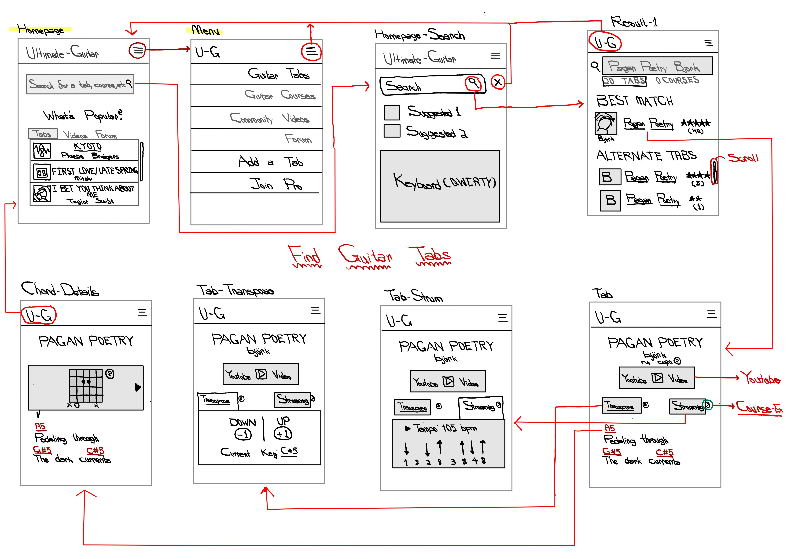
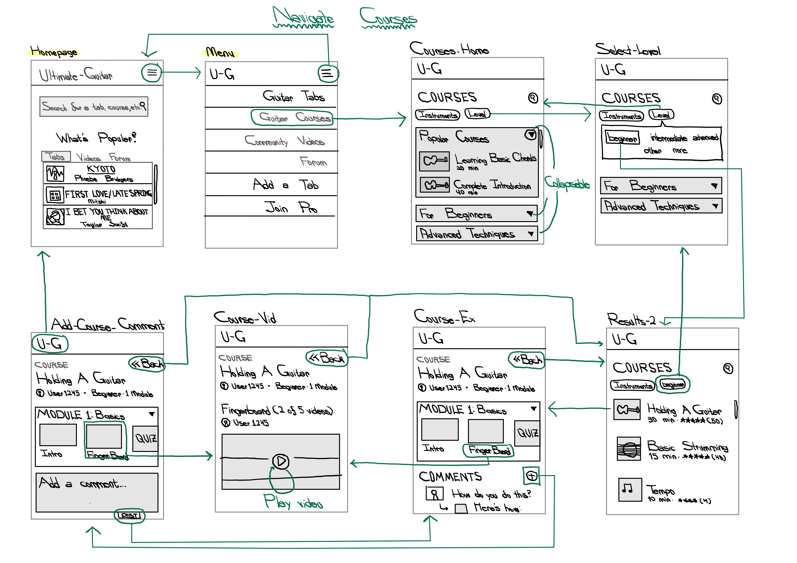
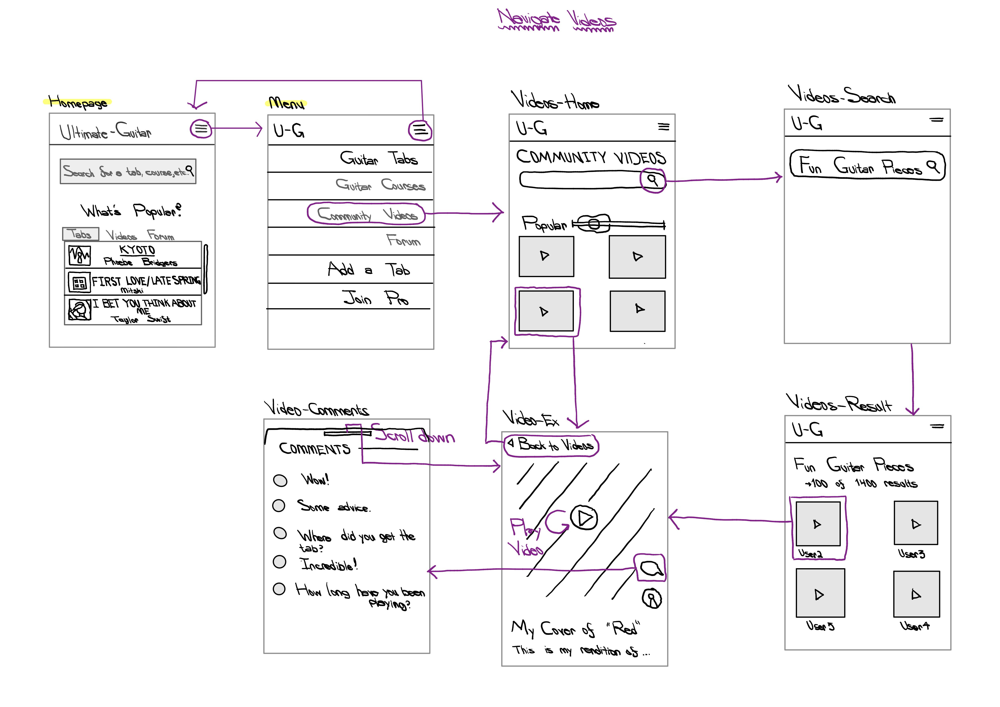
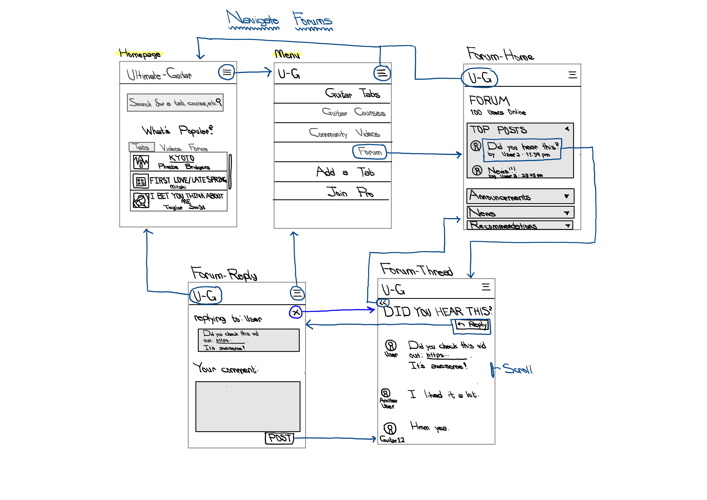
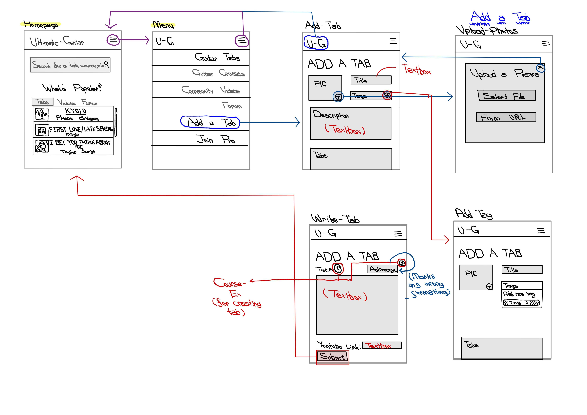
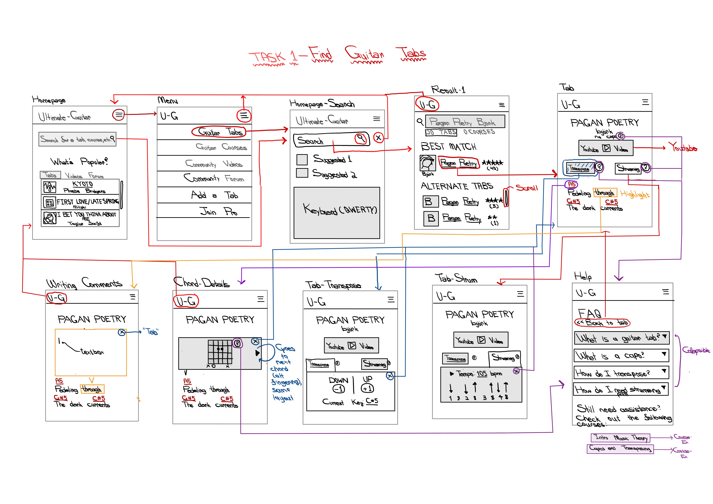
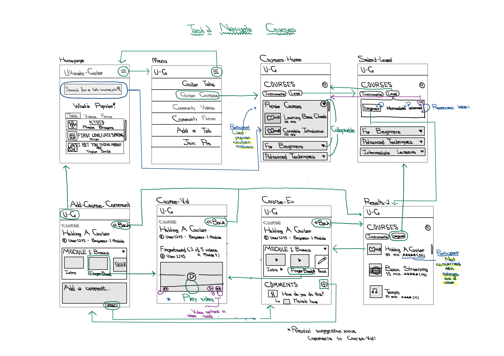
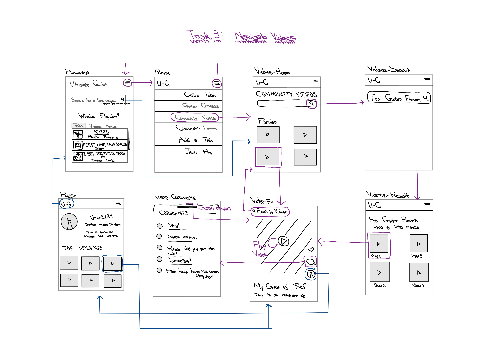
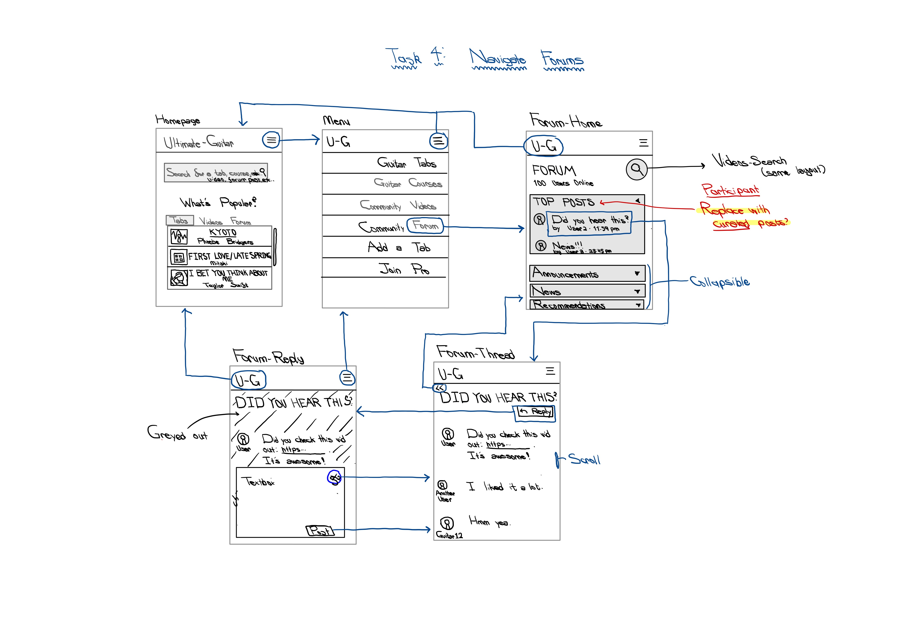
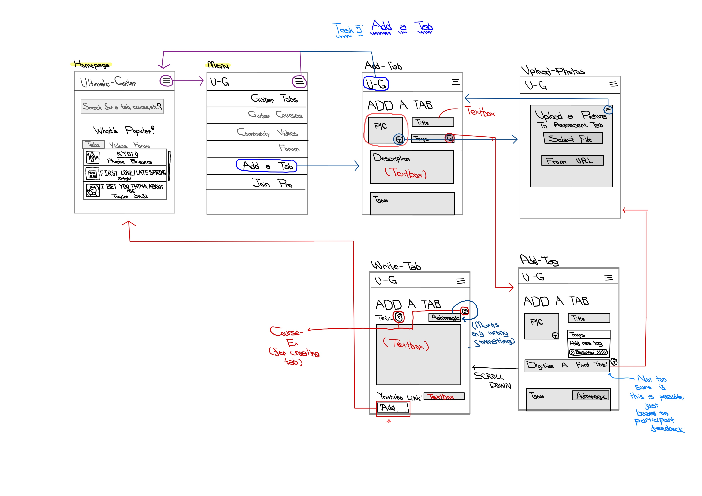

# Assignment 05: Low-Fidelity Prototype

James Yoon

Digital Humanities 110: User Experience and Design (S'22)

# What is Low-Fidelity Prototyping?

This low-fidelity prototype illustrates the basic information architecture of the proposed redesign for Ultimate-Guitar. By focusing on general flow and interactivity over the actual graphics, we can ensure that the actual layout and the content fulfill our original needs outlined in our persona analysis. My goal when creating these wireframes and wireflows was to increase the cleanliness of the design (following the 80:20 rule) while ensuring that the app was accessible to both novice and advanced guitar players. 

In my contextual inquiry, I learned that guitar players need some sense of music theory to learn the instrument. Some (like my interviewee) learned it from piano or previous musical training, but other people never learned music theory at all and need a structured way to develop those skills. I also learned that playing with a track is incredibly helpful in knowing when to play a chord relative to a specific lyric, that playing in groups (e.g. at church or in school) helps build community and motivate playing, and that musicians like to write in their sheet music regarding time signatures and tempos, which may be something I would want to have in my guitar tabs.

The personas I kept in mind when constructing this low-fidelity prototype were the two personas from UX storytelling (Assignment 4): 

- **Richard Smith**: a data scientist who just picked up guitar; little to no experience with musical instruments or theory.
- **Elizabeth Perez**: an experienced pianist who just picked up guitar for her band; struggles with finding inspiration for new guitar techniques or chord progressions. 

[The personas can be found here.](https://james-y-yoon.github.io/DH110-JamesYoon/Storytelling/)

The tasks that I used for the wireflows were:

- **TASK 1**: Navigating a guitar tab and transposing it up one whole step.
- **TASK 2**: Finding and interacting with a beginner guitar course.
- **TASK 3**: Interacting with (and commenting on) a guitar video.
- **TASK 4**: Replying to a forum thread.
- **TASK 5**: Contributing your own guitar tab (more advanced - was not in my persona + usage scenarios)

# Initial Wireflow (v.1)

[My first iteration of my wireflow (including wireframes) can be found here.](Low-Fidelity-Prototype-1.pdf) The respectives pages of the PDF correspond to the tasks above (i.e. Task 1 is on Page 1). 

# Testing the Wireflow (version 1)

[A video containing the wireflow can be found here.](https://youtu.be/E6BTbi1-4Wg) In this video, my interviewee traces through my original wireflow for all five tasks, noting when there is confusion. While they were talking out loud, I wrote notes for potential revisions below.

# Key Insights

The participant was able to complete the tasks, although I did have to explain what a guitar tab and transposition was. Nevertheless, after those conceptual hurdles, they were able to perform the task (although they did mention certain difficulties, which I outline below). 

- They initially had issues trying to get from the homepage to the tabs page. This iwas due to having two ways to reach the guitar tabs page: the first being through the menu bar and the second through the search bar.

> They did get the hang of it later, and I do want to make sure users have enough flexibility to choose how to go to each page on the site (based on the flexibility heuristic). Therefore, I suspect that it may have been due to how I wrote and constructed the wireframe itself, so I don't propose any revisions for my final product.

- They did note that transposition/transpose may be too niche of a term to use.

> I want to make sure that both advanced and novice users can access this site, and the former are likely used to the term transpose (as well as most users with some music theory backgrounds). I initially had little question buttons on my wireframe next to the Transpose button; however, I did not include their flow (I implicitly wanted them to direct to a help page or a course detailing what transposing a piece means). I will adjust this by making the question button more conspicuous and adding it to my wireflow.

- There were some inconsistencies in my wireflow diagram (especially in regard to the searchbar on Home). Can the search bar be used to go to courses? How about forums/videos? No arrows were present in the second to fifth tasks that indicated whether or not this was possible, or if you could only search tabs.

> This was largely my fault - I forgot to add these interactions in my original wireflow. I will be more clear as to what can be searched (tabs, courses, forums, videos) rather than the existing "Search for a tab, course, etc...". I will also add those interactions to my wireflows.

- They found that the "Other" and "More" descriptions under Level in the "Select-Level" wireframe were very vague.

> I definitely agree! I think it's hard to tell what Other means (e.g. does it mean no difficulty level or some intermediary between the set three)? What does None mean? I plan to remove those two options and then also add a X button on those options so that they can select or unselect these options.

- They noted that the placement of comments and the ratings would influence whether or not they interact with a course.

> This isn't something I thought about during my heuristic analysis or user research, but it's something I want to keep in mind. If the courses are sponsored by Ultimate-Guitar versus crowd-sourced, would I want to display the ratings the same way? Without ratings, how would I ensure that the courses are high-quality? And comments-wise: aside from potential spam, is it smart to have comments on the course home page ("Course-Ex"), the video itself ("Course-Vid"), or both? Would comments on the course home page potentially detract viewers while adding enough substantial information to be useful in the first place? I'm not sure if there is a "right" answer, but I want to revisit this in future Usability Testing.

- They assumed that "(2 of 5 videos)" in "Course-Vid" referred to Fingerboard (i.e. there were 5 videos in the Fingerboard section) rather than the module 1. 

> This is a small fix - I would just add "(2 of 5 videos in module)" to make this more clear

- Video Interactivity: they wanted to make sure that they were able to speed up/slow down/skip through the videos on Courses.

> This is important (and something that was addressed in my contextual inquiry). There should be controls on the videos that are similar to Youtube (or other video hosting platforms) that allows for greater flexibility.

- The guitar design on "Videos-Home" was confusing; they weren't sure what its purpose was.

> I totally agreed. Initially, I made it as more of a decorative slider (moving it left and right would reveal more videos. However, after this testing stage, I now think it's probably better to simplify it and remove it completely. I can revisit aesthetics in the high-fidelity prototype.

- They noted that not having lines between comments (in the wireframe "Video-Comments") made it difficult to distinguish between different comments and users. 

> I want to make it more clear between the end of one comment and the beginning of another. Perhaps lines or more spacing? Perhaps another signifier (e.g. put the person's name beneath their reply so that it's clear when their comment ends).

- There needs to be a search function on "Forum-Home", since users may want to search specific topics rather than just searching through specific subforums or the top posts. Furthermore, the "Forum-Reply" frame had a lot of redundant information (the "replying to: User" and "Your Response").

> I would want to simplify the Forum-Reply so that what's really important is the user's comment and their ideas. Perhaps one large textbox with minimal clutter would work better? I also want to add a search bar to Forum, perhaps as one magnifying glass button that expands into a full search bar once pressed?

# Revised Wireflow (v.2)

[My second iteration of my wireflow (including wireframes) can be found here.](Low-Fidelity-Prototype-2.pdf) The respectives pages of the PDF correspond to the tasks above. 

## Additional Changes to the Initial Wireflow

In addition to the changes proposed in Insights, I also added a way to comment on the tabs themselves. This change was prompted by my contextual inquiry ethnography, where I saw many of the musicians marking their sheet music with specific annotations about tempo, fingerings, etc...

# Lessons Learned

The process was pretty fun! I was initially unsure of exactly what amount of detail to put into my low-fidelity prototype, but over time I really got into thinking about where things would be placed and whether my button placement would be the most intuitive. Testing my prototype was also a great learning experience. It was a bit awkward at the beginning, but I began to see certain problems with my design that I hadn't even thought about before. It also brought back certain insights that I learned during user research, and it made me question exactly what each button did and whether it was in the appropriate place. 

## Future Prototypes and Testing

In the future, if I was faced with the same time constraints, I'd definitely want to focus more on one or two tasks rather than five. That way, I could get into more details about rare cases and show more interactivity in my wireframes. I'd also want to try a larger canvas so that I could fit all of my wireframes onto one canvas; unfortunately, I had to separate each task due to space constraints while noting that all tasks were related to each other by the homepage.
