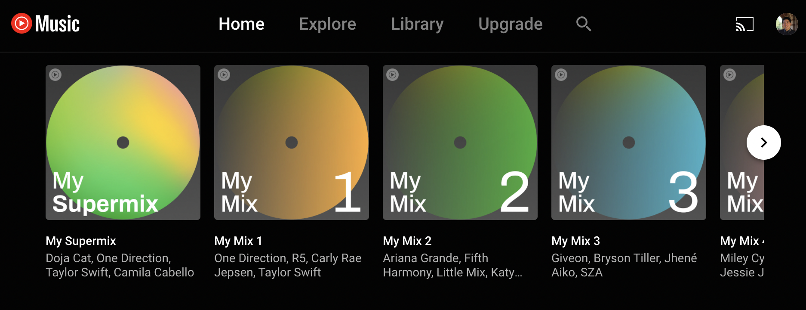

# DH 110 Project

## James Yoon, Spring 2022

I'm hoping to do my DH project on improving the YouTube Music app interface to make it more comparable to Spotify and other music streaming services. Part of my idea is to make it more clear which entries are videos, which are playlists, and which are mp3s. I'd also like to increase accessibility to a user's uploaded music library from the main menu.

https://music.youtube.com/

