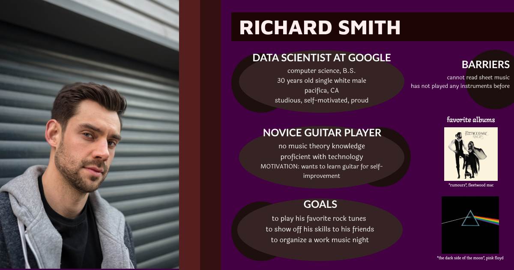
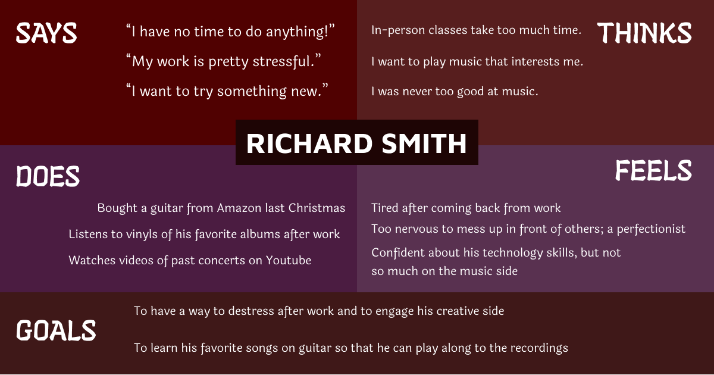
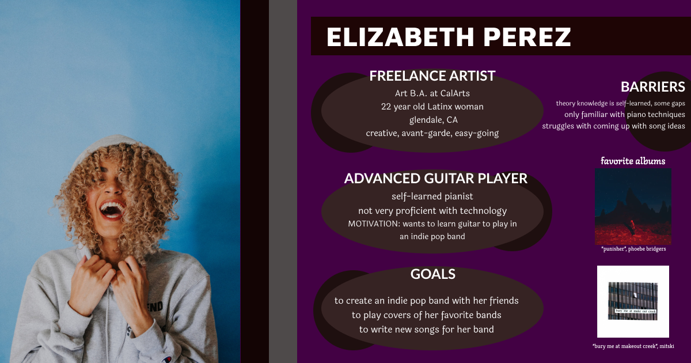
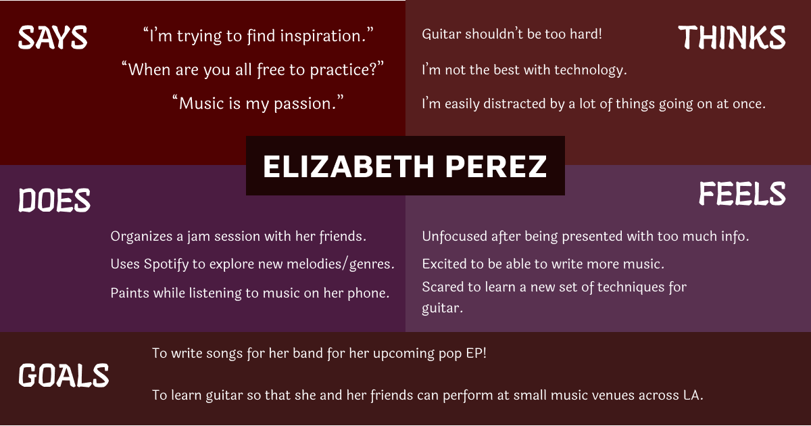
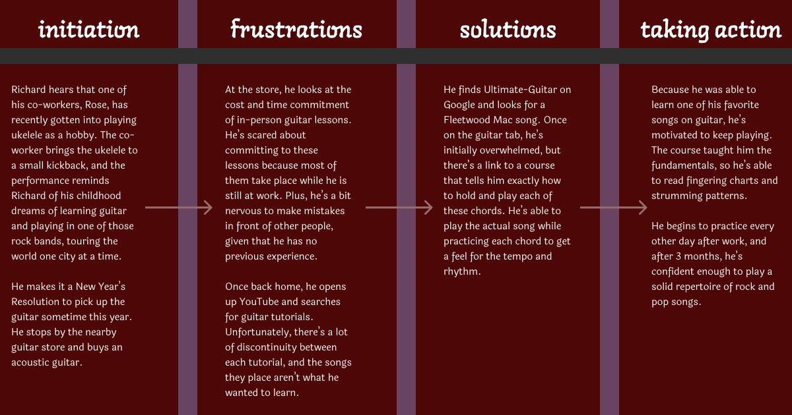
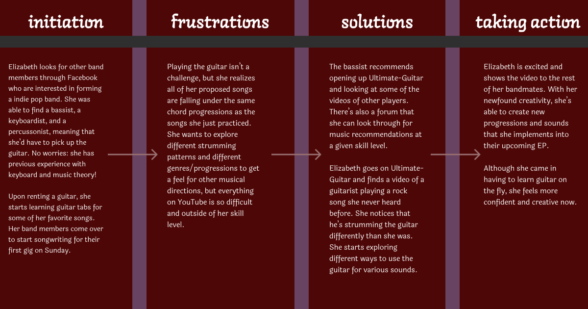

# UX Storytelling

James Yoon

Digital Humanities 110: User Experience and Design (S'22)

## What is Design Storytelling?

Design storytelling is a way in which UX designers can view their proposed project through their user's eyes. Oftentimes, we as designers can come in with preconceived notions either from our own experiences or through our research, which may not be applicable to the other demographics in our target audience. By putting ourselves in the shoes of certain "personas", we're able to identify each of these personas' needs and motivations and illustrate how our product can solve these needs.

In my project, I will use design storytelling to ensure that my design takes into account the needs of both novice and advanced guitar players, as well as varying levels of music theory. Plus, people who use Ultimate-Guitar may use it for different things: some may want to perform these pieces, while others want to learn something new. This step is crucial in making sure my design addresses those needs.

## Personas

I developed two personas for my project: Richard Smith and Elizabeth Perez.

### Richard Smith

### Elizabeth Perez

## Proposed Tasks

My proposed design would have the functionality for users to:

1. Find guitar tabs of their favorite songs and provide them enough theory or guitar technique information to get started. In particular, they will have the ability to go to applicable courses directly from a guitar tab.
2. Find inspiration for new songs to play through an easy-to-navigate videos and forums tab. They would have the ability to filter through these videos or forum recommendations based on skill level, genre, instrument, etc...

## Scenario #1: Richard Smith and Learning Guitar Tabs

### Scenario Context
> Richard Smith is a data scientist at Google and wants to learn guitar after watching his co-worker play ukelele at a small kickback. After buying a guitar from the local music store, he's excited to learn how to play his favorite songs in the comfort of his own home - that way, he can learn at his own pace while not having to worry about making mistakes in front of other people. His goal is to learn his favorite rock songs from his currently most-played albums on the guitar, even without previous guitar, instrument, or music theory experience.

### Use Cases
> Richard opens Ultimate-Guitar on his laptop while holding his guitar on his lap. At the top, there is a search bar that allows him to search for any song. He inputs "Dreams" by Fleetwood Mac and finds a guitar tab. After clicking on the guitar tab link, he is redirected to the tab itself, with the chord fingerings present as interactive bubbles that open once the mouse hovers over them. He also sees an option to go to relevant, applicable courses ("How To Play _ Chords" and "How To Strum") at the top of the tab as blue buttons, which he presses. A course pops up in a different window, where he is able to look through the videos (and transcripts) to find the most directly applicable videos. The videos are sometimes followed by short quizzes on basic terminology, like a barre chord, which Richard finds useful. Finally, he goes back to the tab itself and practices it using the chords he just learned. He double checks that his fingerings are correct by hovering over the chord notations for those interactive bubbles. He is also able to play the song itself through a large Play button at start of the tab, which allows him to strum the guitar to the actual recording.

### User's Journey

## Scenario #2: Elizabeth Perez and Getting Inspiration

### Scenario Context

> Elizabeth Perez is a musician (albeit not a guitar player) and has just created a local band consisting of a bassist, a percussionist, and a keyboardist. As a result, she has to pick up guitar, although because of her years of musical training, she finds it relatively easy to learn chords and basic strumming. However, once her bandmates and she join for a songwriting session in her garage before their next concert, she realizes that she feels relatively constrained by the limited number of guitar techniques and genres she can play. She finds that she keeps reverting to the same guitar chord progressions as the songs she recently learned. Her goal is to diversify her guitar knowledge, both in the genres that she can play, typical chord progressions, and strumming techniques. That way, she can write more complex, interesting songs.

### Use Cases
> After opening Ultimate-Guitar, Elizabeth notices that there is a Video Gallery option in the main menu. She clicks on that button and is redirected to a new window containing a playlist of curated videos uploaded by other users. Each video is associated with a specific skill level and genre (as "tags"), and she is able to filter through the videos to find videos for relatively beginner guitar players. She is able to scroll through the videos and comment by clicking on a speech bubble icon, which redirects her to a pop-up. The videos also have a description, where the author can go into what song they are playing and recommend similar songs. Some of these descriptions have enough information so that Elizabeth can start looking up new techniques on her own!

> Elizabeth is then able to navigate to the home page and finds a Recommendations module, where users can vote for certain songs/videos/tabs to be spotlighted. There are "up" and "down" arrows associated with each video, so users can upvote and downvote videos based on their quality. The tabs/videos/songs are separated so that she knows exactly what entry is what. She's able to find a video that she hasn't seen before, which makes her excited!

### User's Journey

